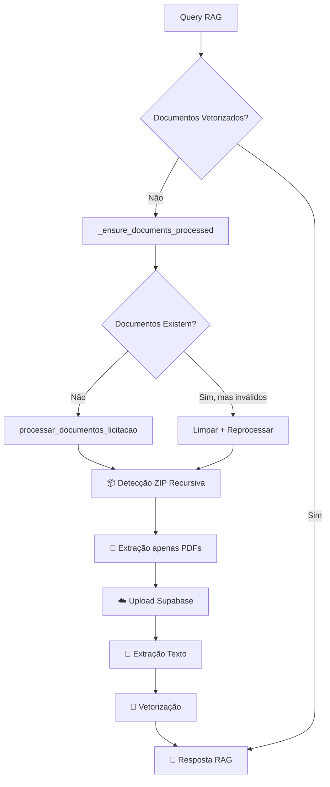

# 🚀 Integração RAG + UnifiedDocumentProcessor Recursivo

## 📋 Visão Geral

Esta integração combina o **RAG Service** com o **UnifiedDocumentProcessor** recursivo para criar um fluxo automático completo:

1. **Detecção automática**: RAG detecta quando documentos não estão processados
2. **Processamento recursivo**: UnifiedDocumentProcessor extrai PDFs de ZIPs aninhados automaticamente  
3. **Vetorização inteligente**: Documentos são convertidos em chunks e embeddings
4. **Resposta RAG**: Sistema responde perguntas baseado nos documentos processados

## 🔄 Fluxo de Integração



## 🛠️ Principais Melhorias Implementadas

### 1. **Método `_ensure_documents_processed()`**
**Localização**: `src/services/rag_service.py`

```python
def _ensure_documents_processed(self, licitacao_id: str) -> Dict[str, Any]:
    """
    🚀 NOVA FUNÇÃO: Garante que documentos estão processados usando 
    UnifiedDocumentProcessor recursivo
    """
```

**Funcionalidades**:
- ✅ Verifica se documentos já existem e são válidos
- 🔧 Remove documentos corrompidos/inválidos automaticamente
- 📦 Chama processamento recursivo se necessário
- 🔍 Diagnóstico detalhado de erros da API PNCP
- 📊 Validação de tamanho e tipo de arquivo

### 2. **Aprimoramento do `_vectorize_licitacao()`**
**Antes**:
```python
if not self.unified_processor.verificar_documentos_existem(licitacao_id):
    result = self.unified_processor.processar_documentos_licitacao(licitacao_id)
```

**Depois**:
```python
documentos_result = self._ensure_documents_processed(licitacao_id)
if not documentos_result['success']:
    return documentos_result
```

### 3. **Endpoint de Reprocessamento Forçado**
**Nova rota**: `POST /api/rag/reprocessar`

```json
{
    "licitacao_id": "uuid",
    "forcar_reprocessamento": true
}
```

**Funcionalidades**:
- 🗑️ Limpa documentos, vetores e cache existentes
- 🔄 Força reprocessamento completo
- 📦 Usa extração recursiva de ZIPs
- 📊 Retorna detalhes do processamento

### 4. **Melhor Tratamento de Erros**
**Categorização de erros**:
- `licitacao_not_found`: Licitação não existe no banco
- `api_error`: Problema na API PNCP
- `processing_error`: Erro no processamento de documentos
- `critical_error`: Erro crítico inesperado

**Respostas detalhadas**:
```json
{
    "success": false,
    "error": "Erro na API PNCP: HTTP 404",
    "suggestion": "Verifique se a licitação possui documentos disponíveis na API",
    "action": "api_error",
    "licitacao_info": {
        "objeto": "Aquisição de materiais...",
        "orgao": "Prefeitura Municipal",
        "uf": "SP"
    }
}
```

## 📡 Endpoints Disponíveis

### 1. **Análise Principal** 
```http
POST /api/rag/analisarDocumentos
Content-Type: application/json

{
    "licitacao_id": "uuid",
    "query": "Faça um resumo dos documentos" // opcional
}
```

**Fluxo automático**:
1. Verifica cache
2. Verifica vetorização
3. **🆕 Processa documentos recursivamente se necessário**
4. Vetoriza documentos
5. Responde query
6. Cacheia resultado

### 2. **Query Específica**
```http
POST /api/rag/query
Content-Type: application/json

{
    "licitacao_id": "uuid", 
    "query": "Qual o valor estimado?"
}
```

### 3. **🆕 Reprocessamento Forçado**
```http
POST /api/rag/reprocessar
Content-Type: application/json

{
    "licitacao_id": "uuid",
    "forcar_reprocessamento": true
}
```

### 4. **Status de Processamento**
```http
GET /api/rag/status?licitacao_id=uuid
```

### 5. **Invalidar Cache**
```http
POST /api/rag/cache/invalidate
Content-Type: application/json

{
    "licitacao_id": "uuid"
}
```

## 🧪 Como Testar

### 1. **Teste Automatizado**
```bash
# Teste completo de integração
python test_rag_integration.py

# Teste com ID específico
python test_rag_integration.py "d0fdad57-83ed-417e-a552-f70e6eedb70d"
```

### 2. **Teste Manual via cURL**

**Reprocessar documentos**:
```bash
curl -X POST http://localhost:5000/api/rag/reprocessar \
  -H "Content-Type: application/json" \
  -d '{"licitacao_id": "d0fdad57-83ed-417e-a552-f70e6eedb70d"}'
```

**Análise RAG**:
```bash
curl -X POST http://localhost:5000/api/rag/analisarDocumentos \
  -H "Content-Type: application/json" \
  -d '{
    "licitacao_id": "d0fdad57-83ed-417e-a552-f70e6eedb70d",
    "query": "Qual o objeto desta licitação?"
  }'
```

## 🔍 Validação de Documentos

### **Critérios de Documentos Válidos**:
- ✅ Tipo MIME: `application/pdf`, `application/msword`
- ✅ Tamanho: > 1KB (evita arquivos corrompidos)
- ✅ Conteúdo: Não é HTML de erro
- ✅ Estrutura: PDFs com magic bytes corretos

### **Processamento Recursivo**:
- 📦 Detecta ZIPs por magic bytes (`PK\x03\x04`)
- 🔄 Extrai recursivamente até encontrar apenas PDFs
- 📄 Filtra apenas arquivos úteis (.pdf, .doc, .docx, .txt)
- 🗑️ Ignora arquivos de sistema (`__MACOSX`, `.DS_Store`)

## 📊 Exemplo de Resposta

```json
{
    "success": true,
    "answer": "Esta licitação refere-se à aquisição de lubrificantes...",
    "query": "Qual o objeto desta licitação?",
    "licitacao_id": "d0fdad57-83ed-417e-a552-f70e6eedb70d",
    "chunks_used": 8,
    "sources": [
        {
            "documento_titulo": "Edital_PE_90010_Lubrificantes.pdf",
            "chunk_text": "OBJETO: Aquisição de lubrificantes...",
            "page_number": 1,
            "relevance_score": 0.89
        }
    ],
    "processing_time": 2.45,
    "model_response_time": 1.2,
    "cost_usd": 0.012,
    "model": "gpt-4o-mini",
    "cached": false,
    "processing_info": {
        "documents_processed_this_session": true,
        "processing_method": "recursive_zip_extraction",
        "vectorization_completed": true
    }
}
```

## 🚨 Troubleshooting

### **Problema**: "Licitação não encontrada"
```json
{
    "success": false,
    "error": "Licitação d0fdad57-... não encontrada no banco de dados",
    "action": "licitacao_not_found"
}
```
**Solução**: Verificar se a licitação foi importada corretamente

### **Problema**: "Erro na API PNCP"
```json
{
    "success": false,
    "error": "Erro na API PNCP: HTTP 404",
    "action": "api_error"
}
```
**Solução**: Licitação pode não ter documentos disponíveis na API

### **Problema**: "Documentos inválidos"
```json
{
    "success": false,
    "error": "Documentos existem mas são inválidos, reprocessando...",
    "action": "processing_error"
}
```
**Solução**: Sistema reprocessa automaticamente

## 🔧 Configuração

### **Dependências**:
```python
# RAG Service precisa:
from core.unified_document_processor import UnifiedDocumentProcessor

# Inicialização:
rag_service = RAGService(
    db_manager=db_manager,
    unified_processor=unified_processor,  # ← Integração aqui
    openai_api_key=openai_key
)
```

### **Timeouts**:
- Reprocessamento: 5 minutos
- Análise RAG: 5 minutos  
- Query específica: 1 minuto

## 🎯 Benefícios da Integração

1. **🔄 Automático**: Processamento acontece transparentemente quando necessário
2. **📦 Recursivo**: Extrai PDFs de ZIPs aninhados automaticamente
3. **🛡️ Robusto**: Validação e tratamento de erros aprimorados
4. **⚡ Performance**: Cache inteligente evita reprocessamento desnecessário
5. **🔍 Observabilidade**: Logs detalhados e feedback de estado
6. **🧪 Testável**: Suite de testes automatizados incluída

---

**🎉 Resultado**: Sistema completamente integrado que processa automaticamente documentos complexos (ZIPs recursivos) e responde perguntas inteligentes via RAG! 